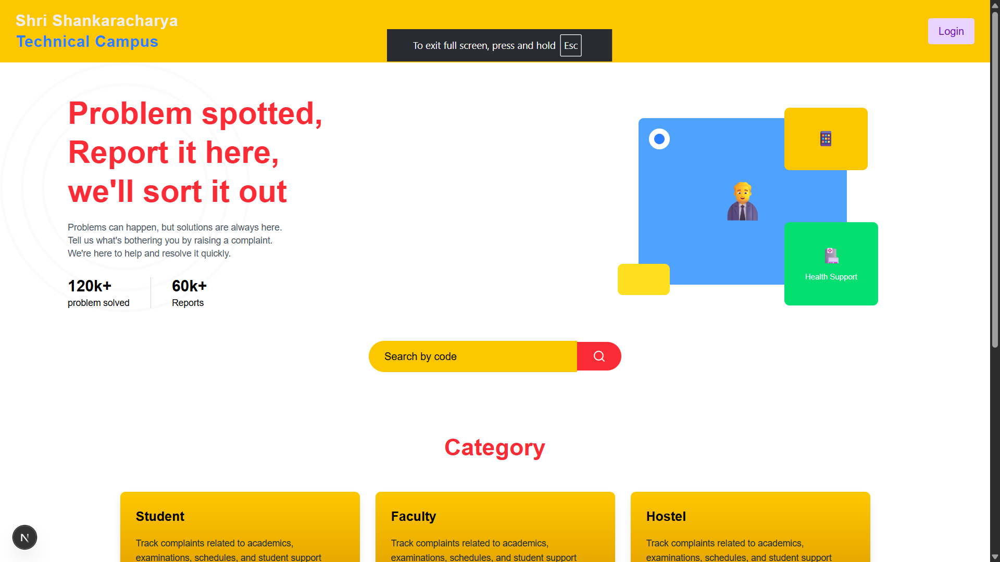
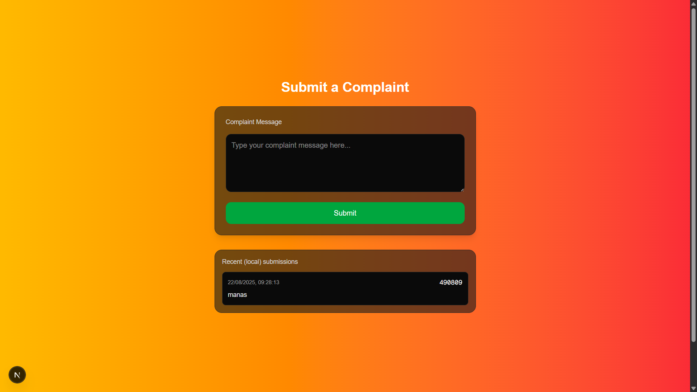
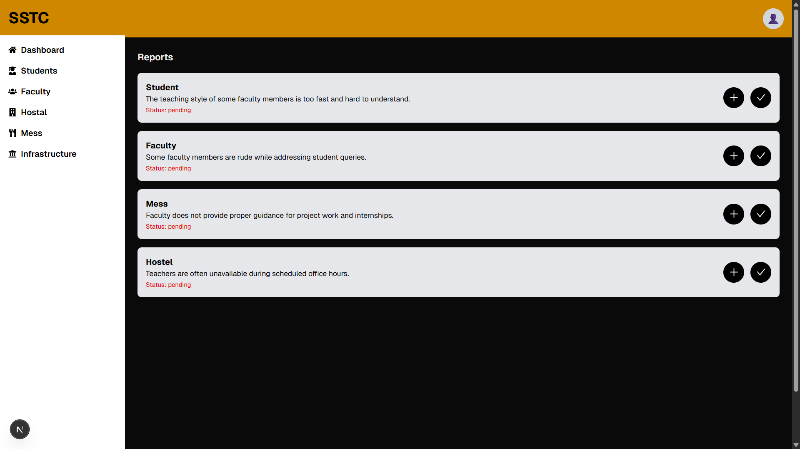

# 📝 Complaint Box  

**Team: ByteForge**  

---

## 📑 Table of Contents
- [Overview](#overview)  
- [Features](#features)  
- [Tech Stack](#tech-stack)  
- [Setup Instructions](#setup-instructions)  
- [Usage](#usage)  
- [Future Plans](#future-plans)  

---

## 📸 Screenshots  

> If the images are not visible, please check the `public` folder (all images are there).  

  
  
  
  

---

## 📖 Overview  

**Complaint Box** is a platform that allows students to **submit complaints anonymously** regarding issues in their institution. Students can express concerns freely without revealing their identity, ensuring problems are addressed effectively.  

---
## 📂 Project Presentation
[View Presentation](https://onedrive.live.com/:p:/g/personal/90AF63C5F2DB76E2/ERl7-I8c3CBOnGjL3q9v8I8BvRDKTCj4ce7B04RXUnAcfg?resid=90AF63C5F2DB76E2!s8ff87b19dc1c4e209c68cbdeaf6ff08f&ithint=file%2Cpptx&e=27zth7&migratedtospo=true&redeem=aHR0cHM6Ly8xZHJ2Lm1zL3AvYy85MGFmNjNjNWYyZGI3NmUyL0VSbDctSThjM0NCT25HakwzcTl2OEk4QnZSREtUQ2o0Y2U3QjA0UlhVbkFjZmc_ZT0yN3p0aDc)


## ✨ Features  

### 👨‍🎓 Student Features  
- Submit complaints **category-wise**.  
- Track complaints using a **secret code**.  
- View complaint status: **Pending** / **Solved**.  
- See faculty/admin replies to complaints.  

### 🛠️ Admin Features  
- Secure **Admin Login**.  
- Reply to complaints on behalf of faculty.  
- Mark complaints as **Solved**.  

### 🚀 Future Features  
- Auto-forward unresolved complaints to higher authorities after a set time.  
- AI-powered responses and complaint analytics.  

---

## 🛠 Tech Stack  

- **Frontend:** Next.js, React.js, CSS  
- **Backend:** Node.js, Express  
- **Database:** Firebase Firestore  
- **Design:** [Figma Design](https://www.figma.com/design/tHDhtXCJxa31YUrPEMSgPY/VeilVoice?node-id=0-1&t=EXXS8U7bQEanePNb-1)  
- **Version Control:** GitHub  
- **Assets:** Icons & Images from multiple sources  
- **Future AI Integration:** GPT, Perplexity  

---

## ⚙️ Setup Instructions  

Follow these steps to run the project locally:  

1. **Clone the repository**  
   ```bash
   git clone https://github.com/Manas-gupta-04/ByteForge-VeilVoice.git
   cd ByteForge-VeilVoice
   ```  

2. **Install dependencies**  
   ```bash
   npm install
   ```  

3. **Set up environment variables**  
   - Create a `.env` file in the root directory.  
   - Add your Firebase credentials and secret keys:  
     ```env
     FIREBASE_API_KEY=your_api_key
     FIREBASE_PROJECT_ID=your_project_id
     JWT_SECRET=your_jwt_secret
     ```  

4. **Set up Firebase database**  
   - Configure Firestore with the following collections:  
     - `complaints`  
     - `users`  

5. **Run the project**  
   ```bash
   npm run dev
   ```  

6. **Open in browser**  
   - [http://localhost:3000](http://localhost:3000)  

---

## ▶️ Usage  

### Student Flow  
1. Open **Complaint Box** to submit a complaint.  
2. Select a **category** and submit.  
3. Receive a **secret code** for tracking.  
4. Check complaint status: **Pending / Solved**.  
5. View **faculty/admin replies** if available.  

### Admin Flow  
1. Log in securely to the **Admin Dashboard**.  
2. Review submitted complaints.  
3. Add **replies** to complaints.  
4. Mark complaints as **Solved**.  

---

## 🔮 Future Plans  

- **Escalation System** – Automatically forward unresolved complaints to higher authorities.  
- **AI Integration** – Smart replies, categorization, and analytics using AI.  

---

✨ **ByteForge — Empowering Student Voices**  
